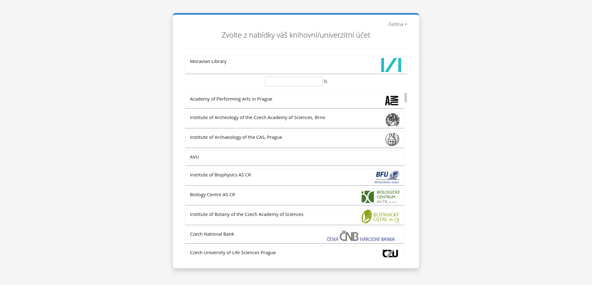

# keycloak-theme-kramerius
Tohle je repozitář Keycloak motivu pro systém Kramerius7 využívajícího autentizačního systému Keycloak, konkrétně fork od EOSC. Zdrojové kódy jsou převzaté z Github repozitáře https://github.com/rciam/keycloak-theme-vanilla, která je pod licencí Apache 2.0. Finální modifikovaný kód pro Krameria tedy není čistý ani optimalizovaný, ale pro potřeby Krameria zatím stačí. Pro případné dotazy kontaktujte kolegy z MZK.

## Jak nainstalovat motiv
1. Z adresy https://github.com/ceskaexpedice/keycloak-kramerius-theme/releases stáhnout soubor`keycloak-kramerius-theme.jar`.
2. Přesunout `jar` soubor do $KEYCLOAK_BASE/providers, je potřeba restart Keycloaku aby se změna projevila např. pomocí `kc.sh build`.

## Jak nastavit motiv
1. Přihlásit se na admin rozhraní vašeho Keycloaku a přejít na Kramerius realm
2. V `Clients` -> `krameriusClient` nastavte motiv `kramerius`
3. V `Realm Settings` -> `Themes` -> `Login Theme`=`kramerius`, `Account Theme`=`kramerius`

## Popis motivu a konfigurace
Vzhled motivu se zobrazuje hlavně jako wayf se seznamem institucí pro přihlášení.

Instituci lze přidat pod formulářem v `Identity Providers` -> {Instituce} -> "Promoted Login Button"=On

Poznámka: Ostatní hodnoty v `configuration.json` se aktuálně nepoužívají

## Jak se zobrazují loga a anglické názvy?
Aktuálně v Keycloaku nelze ukládat loga a jiné atributy jednotlivých Identity Providers. Loga a anglické názvy jsou tudíž aktuálně zapečetěné přímo v motivu jako dočasné řešení v `/src/main/resources/idps.json`, která mapuje aliasy jednotlivých Identity Providers v Keycloaku k jejich atributům jako logo a anglický název, který se poté na motivu zobrazí.

Aliasy by měly být stejné jako v repozitáři, používáte-li metadata z https://raw.githubusercontent.com/moravianlibrary/cdk-idp-list/main/idp.xml. 
Pokud používáte jiný zdroj metadat, tak si prosím vytvořte vlastní `idps.json` se správnými aliasy a jejich příslušnými logy.
